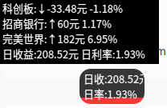
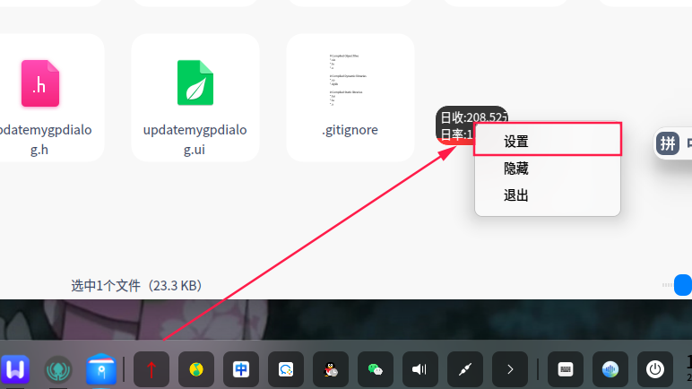
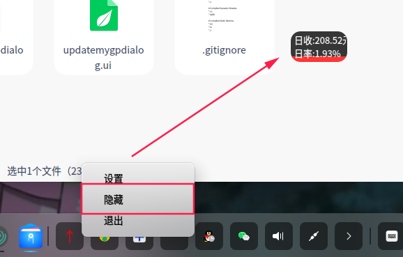
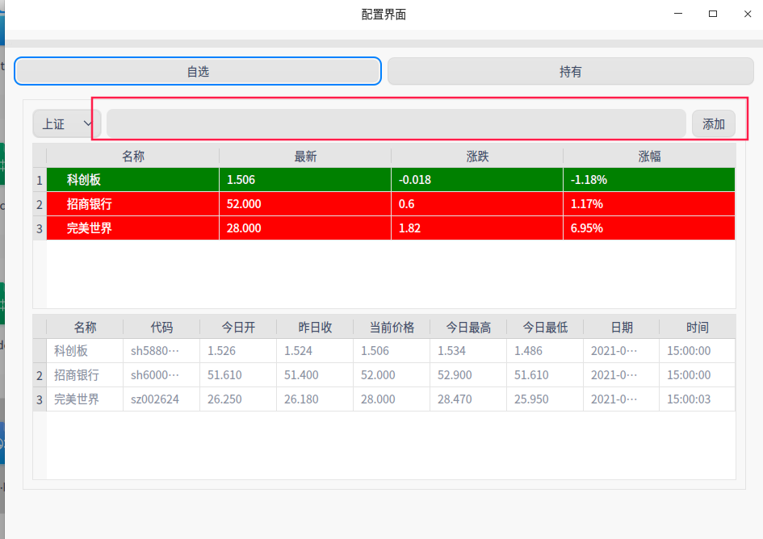
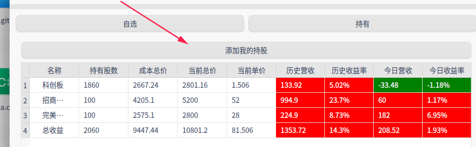
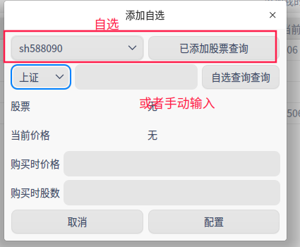
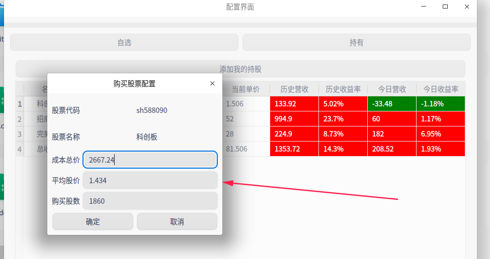

# 股票球，采用的是qt和新浪的api来设计，目前只有查看功能，2021年1月17日开始开发，后续可能会持续更新（可能跟心情有关）

## 编译
只需要qt的原生环境即可，目前开发环境是5.11.3,系统是uos国产操作系统，测试其他linux和windows10均可以使用，当前无外部依赖（后续心情好会增加点有意思的东西）
## 如何使用
打开程序，会出现一个小球，如图所示，右键打开设置主界面可以配置，数据库采用的是本地数据库sqlite，不需要额外创建，代码里面有创建

linux会出现在右上角，windows会出现在屏幕中间

右下角有托盘，可以影藏小球

自选可以查看每日的涨跌

持有界面就可以配置小球的每日涨跌幅度

通过添加我的持股添加

双击行可以更改数据，右键可以删除数据

## 联系我（欢迎提供意见和帮助）

liuminghang0821@qq.com